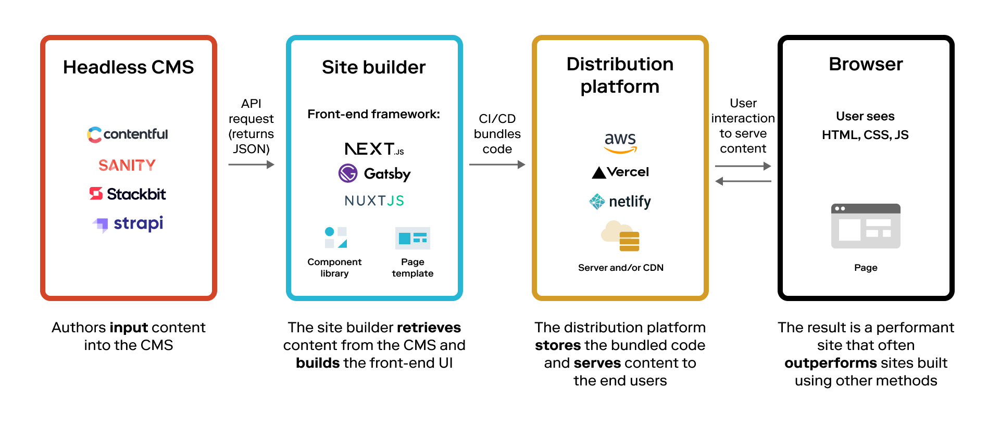

# Introduction

## Before NextJS

Before the advent of JavaScript frameworks like Next.js, integration with a CMS typically followed a traditional or monolithic approach:

- The CMS would be directly integrated into the website. This meant that any content changes had to be done directly on the CMS and then those changes would be reflected on the website.
- A traditional CMS would store all the content and the website data. The developers would use templates built in the CMS to display the content. Hence, the frontend and backend were tightly coupled together, restricting flexibility in the ways content could be displayed.
- With the traditional CMS, every webpage request usually results in a query to the database to fetch content and template information. The content is then rendered server-side and returned to the client.

Wordpress is a prime example of the traditional approach to CMS integration, where the front-end and back-end are directly linked. In this setup, a server-side script fetches content from a database, blends it with a theme and delivers the fully rendered HTML, CSS, and JavaScript to the user's browser for each request. This way, despite its accessibility and wide range of plugins, Wordpress can potentially limit performance, especially for websites with heavy content.

## After NextJS

The advent of Next.js revolutionized the way CMS-based websites were developed. It allowed the use of React, a modern JavaScript library, to build server-side rendered and statically generated web applications. With Next.js, developers were able to fetch data from a CMS at build time, pre-rendering the web pages, and serving them from a global Content Delivery Network, which greatly improved site performance and loading speed. It also paved the way for "Headless CMS" structures, allowing developers to decouple the back-end from the front-end, giving them more flexibility to create customized, dynamic user interfaces without being tied to a traditional CMS's limitations. The dynamic routing and incremental static regeneration features also enhanced SEO and allowed always up-to-date content display.

<!-- TODO create our own picture -->

