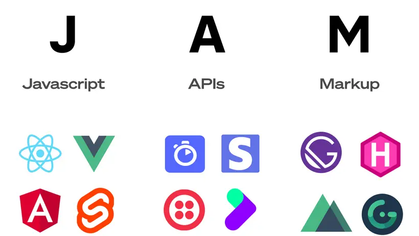
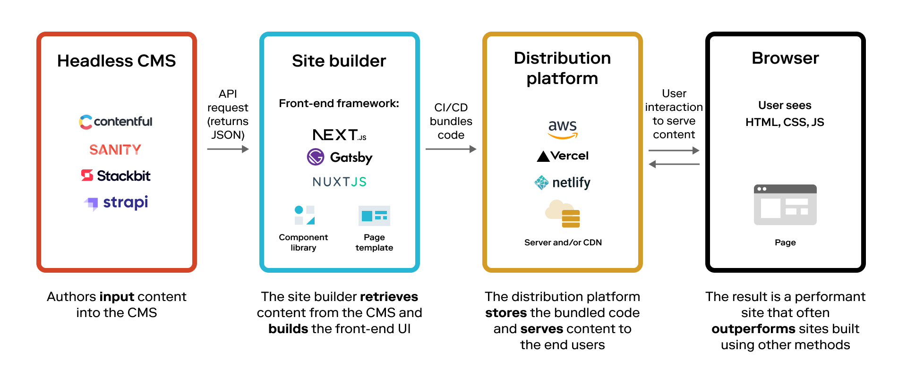

# Introduction

A **Content Management System (CMS)** is a software application that allows users to create, manage, and modify digital content on a website, typically without needing to have a deep understanding of coding.

A traditional CMS includes both the backend (where the content is created and managed) and the frontend (how the content is presented and viewed) of the website. Some examples of traditional CMSs include WordPress and Joomla.

**Headless CMS** is a content management system where the content backend and frontend are decoupled. The headless CMS just takes care of the backend content creation, while the frontend presentation layer is handled separately, typically by a frontend framework like Next.js or Gatsby.

This approach provides more flexibility as it allows developers to deliver content beyond websites and apps to any end platform, using any programming language. It's called "headless" because the frontend presentation layer (the "head") is removed and what's left is the "body" (the backend content management). Some examples of Headless CMSs include Contentful, Strapi, and Sanity.

## JAMstack

The concept of separating the frontend from the backend—like we see with a Headless CMS—is a fundamental aspect of the JAMstack philosophy.

<!-- TODO create our own picture -->

JAMstack stands for JavaScript, APIs, and Markup. In a JAMstack application, JavaScript runs in the browser, handles any dynamic programming during the request/response cycle, APIs are used for all server-side processes or database actions, and Markup is prebuilt at build time, usually using a site generator for content sites or a build tool for web apps.

A typical JAMstack setup involves a static site generator, a headless CMS (for managing content), and backend services accessed through APIs. As such, the JAMstack approach promotes better performance, higher security, and easier scalability.

## Before NextJS

Before the advent of JavaScript frameworks like Next.js, integration with a CMS typically followed a traditional or monolithic approach:

- The CMS would be directly integrated into the website. This meant that any content changes had to be done directly on the CMS and then those changes would be reflected on the website.
- A traditional CMS would store all the content and the website data. The developers would use templates built in the CMS to display the content. Hence, the frontend and backend were tightly coupled together, restricting flexibility in the ways content could be displayed.
- With the traditional CMS, every webpage request usually results in a query to the database to fetch content and template information. The content is then rendered server-side and returned to the client.

Wordpress is a prime example of the traditional approach to CMS integration, where the front-end and back-end are directly linked. In this setup, a server-side script fetches content from a database, blends it with a theme and delivers the fully rendered HTML, CSS, and JavaScript to the user's browser for each request. This way, despite its accessibility and wide range of plugins, Wordpress can potentially limit performance, especially for websites with heavy content.

## After NextJS

The advent of Next.js revolutionized the way CMS-based websites were developed. It allowed the use of React, a modern JavaScript library, to build server-side rendered and statically generated web applications. With Next.js, developers were able to fetch data from a CMS at build time, pre-rendering the web pages, and serving them from a global Content Delivery Network, which greatly improved site performance and loading speed. It also paved the way for "Headless CMS" structures, allowing developers to decouple the back-end from the front-end, giving them more flexibility to create customized, dynamic user interfaces without being tied to a traditional CMS's limitations. The dynamic routing and incremental static regeneration features also enhanced SEO and allowed always up-to-date content display.

<!-- TODO create our own picture -->

Integrating a CMS with modern front-end technologies like Next.js or any of the progressive JavaScript frameworks is a prominent trend in web development. This trend is driven by the push towards the JAMstack architecture (JavaScript, APIs, and Markup), where the aim is to make websites faster, more secure, and easier to scale. It's also facilitated by the rise of headless CMSs, which allow developers to manage content separately from how it's presented, offering more flexibility. Headless CMSs combined with frameworks like Next.js offer a modern, efficient way to build web applications and this approach is indeed a growing trend in the development community.
